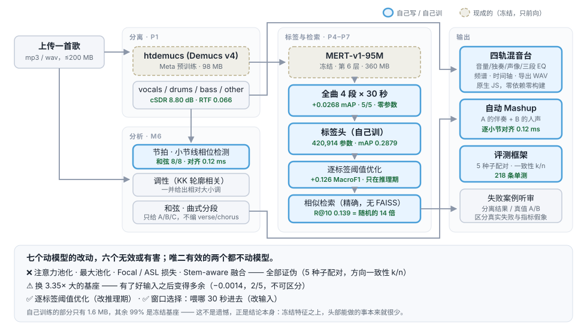
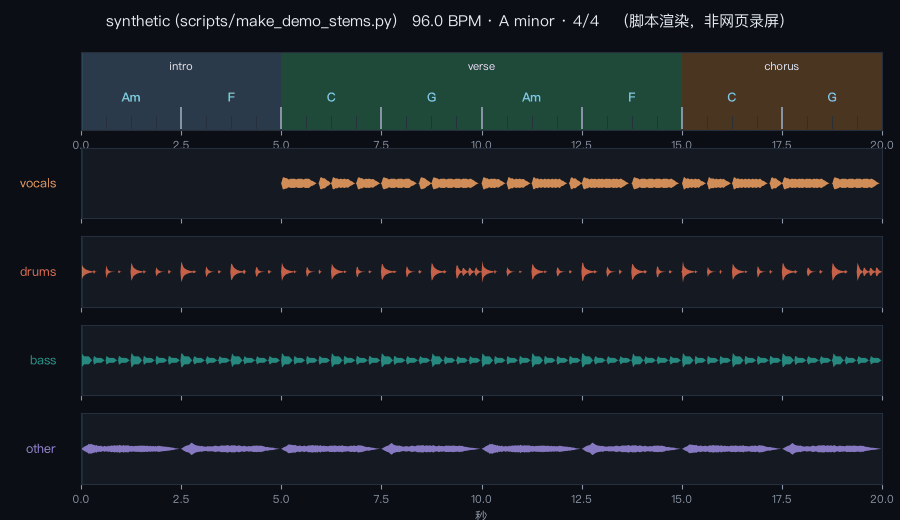

# 音乐理解与智能混音助手

> 上传一首歌 → 拆成人声/鼓/贝斯/其他四轨 → 分析 BPM、调性、和弦、曲式 →
> 打风格/情绪/乐器标签 → 检索相似歌曲 → 在浏览器里重新混音，或和另一首自动拼成 Mashup。

**当前可用**：上传本地歌曲 → htdemucs 四轨分离 → BPM/调性/和弦/曲式分析 →
浏览器混音与 WAV 导出 → 自动 Mashup。



## 核心指标

| | 结果 | 参照 |
|---|---|---|
| **音源分离** | cSDR **8.80 dB** | 官方 htdemucs 9.00，差 0.20 在 ±0.3 容差内 |
| **推理速度** | RTF **0.066** | 约 15× 实时（M2 Max / MPS） |
| **自动标签** | test mAP **0.2879** | 随机 0.0681，**4.2 倍**；且**只用了 9.9% 的数据** |
| **相似检索** | R@10 **0.139** | 随机 0.0099，**14 倍** |
| **Mashup 对齐** | 最大误差 **0.12 ms** | 人耳分辨阈约 20–30 ms |
| **单元测试** | **218 条** | 全部用合成信号，真值由构造方式决定 |

→ 完整数字见 **[一页纸总览](results/SUMMARY.md)**（由脚本从结果文件生成，无一手写）

### 分析结果长什么样



> **这是脚本渲染的可视化（`scripts/make_demo_gif.py`），不是网页录屏。**
> 两者能证明的东西不一样：录屏能证明"界面真的能用"，而这张图只能证明"分析结果长这样"。
> 画的内容与网页时间轴同源（同一份 `analysis.json`），只是没有交互。
> 演示曲由脚本合成，BPM / 拍点 / 和弦 / 曲式**全是已知真值**。

## 这个项目真正想证明的事

不是"我搭了个音乐 AI"，而是**能不能可靠地判断一个改动到底有没有用**。

七个动模型的改动里，**六个被证明无效或有害**：

| 我设计的改动 | 判决 |
|---|---|
| 注意力池化 | ❌ 与平均池化不可区分，且方差是它的 3.5 倍 |
| 最大池化 | ❌ 一致更差 |
| Focal / ASL 不平衡损失 | ❌ ASL 显著有害；机制：它修的是概率标定，而阈值优化把同一件事做得更彻底且免费 |
| Stem-aware 融合（先分离再打标签） | ❌ 两个假设双双证伪；零额外参数的 `sum` 档一致变差，说明加进来的不是信息而是伪影 |
| 换 3.35× 大的基座 | ⚠️ 有了好输入之后**变得多余** |
| **逐标签阈值优化** | ✅ **+0.126 MacroF1**，不改一行模型代码 |
| **窗口选择（全曲 4 段 vs 中间 30 秒）** | ✅ **+0.0268 mAP，5/5 种子一致，零参数代价** |

**唯二有效的两个都不动模型** —— 一个改推理期的阈值，一个改「喂哪 30 秒进去」。

这些结论都来自 **5 种子配对比较 + 方向一致性 k/n**。
如果只跑一次，注意力池化会"赢" 0.004 —— 而种子间标准差就有 0.009。
**从单个数字读结论，会把噪声包装成自研成果。**

支撑这套判断的还有另一条线：项目里记录了 **7 类静默失败**
（看起来完全正常、结果却是错的），每一类都写进了 [DEVLOG](docs/DEVLOG.md)。
最阴险的一次产出了「一个正确的结论，出于完全错误的计算」。

## 我做了什么 vs 用了现成的

| 组件 | 来源 | 我训练了吗 |
|---|---|---|
| htdemucs（分离） | Meta Demucs v4 预训练 | ❌ 直接调用 |
| MERT-v1-95M（特征） | m-a-p 预训练 | ❌ **冻结**，只前向 |
| mir_eval / museval | MIREX 参考实现 | ❌ **刻意不自己写** |
| **标签头** | 自己设计并训练 | ✅ **420,914 参数（1.6 MB）** |
| **评测框架 / 小节线检测 / Mashup 对齐 / 前端 / 服务** | 自己写 | ✅ |

**自己训练的部分只有 1.6 MB，其余 99% 是冻结的预训练基座。**
这不是遗憾，正是实验结论本身：**冻结特征之上，头部能做的事本来就很少。**

## 快速开始

macOS 需要先安装 FFmpeg（`brew install ffmpeg`）。Windows/Linux 请用系统包管理器安装 FFmpeg。

```bash
git clone https://github.com/EthanBAI-dev/musicmix.git
cd musicmix
conda create -n music-mix python=3.11 -y
conda activate music-mix
python -m pip install -e ".[sep]"
python -m scripts.make_demo_stems
python -m scripts.serve
```

打开 <http://localhost:8123/web/index.html>，点击“上传并分离”。首次分离会从
HTDemucs 官方 Hugging Face 仓库自动下载约 **84 MB** 权重，之后使用本机缓存。

> 权重没有复制进本仓库：它已接近 GitHub 普通文件的 100 MB 上限，
> 而且 Demucs 本身能校验并缓存官方权重。这样 clone 更快，模型来源也更清楚。

开发与评测环境：

```bash
python -m pip install -e ".[eval,torch,sep,dev]"
python -m scripts.check_env
python -m pytest tests/ -q
```

## 本地使用

```bash
python -m scripts.serve
```

然后打开 <http://localhost:8123/web/index.html>。

> 用 `scripts.serve` 而不是 `python -m http.server`：后者只发 `Last-Modified`，
> 浏览器会缓存 css/js，改完刷新看不到变化，且症状极具迷惑性（详见 DEVLOG 2026-07-30）。

**页面能做什么**
- 四轨播放：每轨独立 音量 / 静音 M / 独奏 S / 声像 / 三段 EQ，所有增益变化都做平滑，无爆音
- 时间轴：曲式段落色块、和弦标签、小节线与拍点网格，点击定位
- 频谱分析（对数频率轴）、逐轨电平表、波形图
- 导出 WAV（`OfflineAudioContext` 离线渲染，20 秒曲子约 130ms）
- 快捷键：空格播放/暂停、←/→ 前后 2 秒、Home 回到开头
- 上传一首完整歌曲：后台自动分成 `vocals` / `drums` / `bass` / `other`
- 载入已经分离的音轨：文件名含上述四个名称即可
- **P1 失败案例听审**：下拉选案例，一键在「分离结果 / 真值」间 A/B（快捷键 `Tab`），
  切换时保持播放位置不变；每轨标注 cSDR 并区分「真实失败」与「指标假象」

演示音频由 `scripts/make_demo_stems.py` 合成（20 秒 / 96 BPM / A 小调 / Am-F-C-G）。
它的 BPM、拍点、和弦、曲式**全部是已知真值**，所以将来会作为 P3 拍点/和弦/结构模型的第一个测试样例。

---

## 文档导航

| 文档 | 看什么 |
|---|---|
| [00-总体大纲](docs/00-总体大纲.md) | **从这里开始。** 架构图、技术栈、P0~P8 每个阶段做什么、「我做了什么」清单、风险与降级方案 |
| [01-术语表](docs/01-术语表.md) | 项目里出现的每个专业名词的解释（SDR、mAP、Macro-F1、Band-Split、RoPE、AudioWorklet…） |
| [02-方案调研与选型](docs/02-方案调研与选型.md) | 开源方案横向对比、选型理由、参考链接、**「不做什么」清单** |
| [03-评测协议](docs/03-评测协议.md) | 每个指标怎么算、结果表模板、显著性检验、失败案例规范 |
| [04-里程碑与排期](docs/04-里程碑与排期.md) | 9 周计划，逐项勾选清单 |
| [DEVLOG](docs/DEVLOG.md) | **开发日志**，每一步的详细记录，含 7 类静默失败 |
| [一页纸总览](results/SUMMARY.md) | 所有指标，**由脚本从结果文件生成，无一手写** |
| [技术博客](docs/blog/) | 三篇，都以负结果或方法学教训为主 |
| [标签错误分析](results/P9_标签错误分析.md) | 模型难在哪：乐器是真难；部分「错误」疑似漏标 |
| [项目框架-简明版](docs/项目框架-简明版.md) | **不用术语的版本**，5 分钟看懂这个项目在做什么 |

---

## 这个项目想证明什么

不是"能把开源模型串起来"，而是：

| 能力 | 证据 |
|---|---|
| 会做可信的评测 | 复现论文数字（±0.3 dB）、平凡基线 + oracle 上界、配对 bootstrap 显著性检验 |
| 会做真正的改进 | 逐项累加的消融表，而不是"换了个模型效果更好" |
| 有研究思维 | 提出可证伪假设（Stem-aware 的收益主要来自乐器类标签）并用分类别指标验证 |
| 懂工程权衡 | SDR–RTF 帕累托曲线、HNSW 召回/速度权衡、端到端延迟明细 |
| 诚实 | 失败案例专章、代理真值的局限声明、负结果照样写 |

---


## 核心指标（待填）

| 任务 | 指标 | Baseline | Ours |
|---|---|---|---|
| 音源分离 | cSDR (MUSDB18-HQ test 50 首, 4 轨平均) | **htdemucs 8.80 dB**（官方 9.00，差 0.20）| 待 P2 |
| 音乐标签 | mAP / Macro-F1 (MTG-Jamendo) | — | — |
| 相似检索 | HitRate@10 | — | — |
| 推理性能 | 端到端 RTF | — | — |

MUSDB18-HQ test（50 首）上的完整锚点（cSDR，museval 中位数聚合，[P1 报告](results/P1_分离baseline.md)）：

| 锚点 | cSDR 平均 | 作用 |
|---|---|---|
| `silence` 输出全零 | uSDR 恰为 **0.00 dB** | 解析已知值，验证实现正确 |
| `trivial` 混音当每一轨 | -5.34 dB | **下界** |
| `htdemucs` | **8.80 dB** | 复现官方 9.00 dB |
| `oracle` IRM 理想掩码 | 8.95 dB | **掩码类方法的上界** |

> IRM oracle 只是**掩码方法**的上界，不是通用上界 —— Demucs 直接生成波形、
> 能修正相位，实测在 drums/bass 上已与它统计上不可区分（配对 bootstrap p=0.88 / 0.18）。
> M0 时我预期 oracle 在 12~15 dB，那一档其实对应多通道维纳滤波 oracle，预期是错的。

---

## 数据与许可

- **MUSDB18-HQ** — 150 首，非商业研究用途。音频不入库。
- **MTG-Jamendo** — 55,525 首 / 183 标签。元数据 CC BY-NC-SA 4.0，**仅限非商业研究与学术使用；商业使用需 Jamendo S.A. 书面授权**。

本项目为个人学习与研究作品，不作商业用途。

用户上传的原始音频只在本机临时存放，任务结束后删除；分离结果保存在
`web/mine/` 供浏览器播放，该目录已被 Git 忽略，不会被上传。服务默认仅监听
`127.0.0.1`，不向局域网或公网开放。

---

## 环境

```
Apple M2 Max / 64GB · conda env `music-mix` (Python 3.11) · PyTorch 2.13 (MPS) · demucs 4.1.0 · Node 24
```
