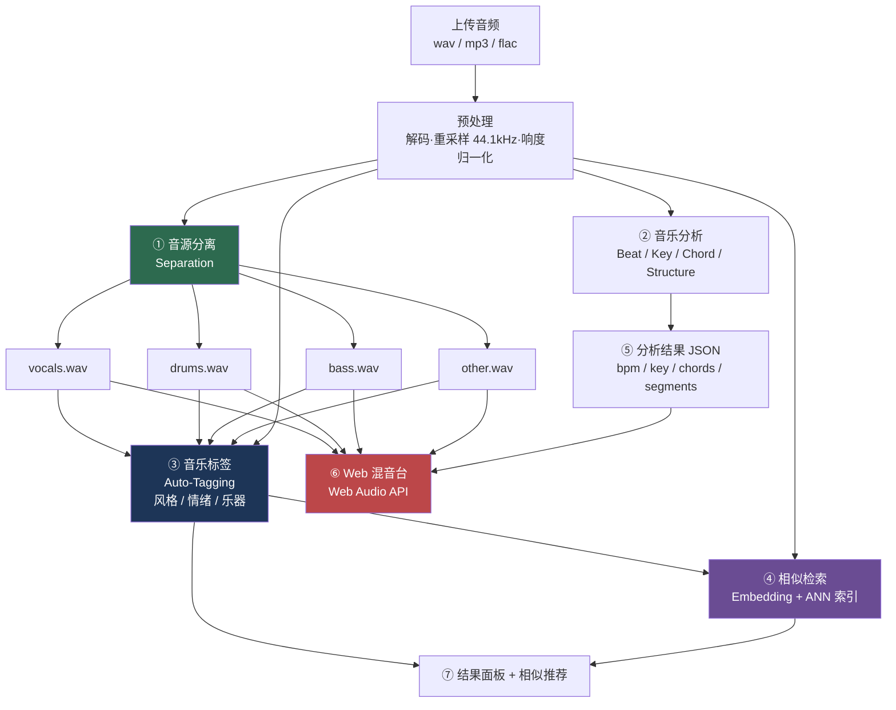

# 音乐理解与智能混音助手 · 总体大纲

> 版本 v1.0 · 2026-07-29
> 配套文档：[01-术语表](01-术语表.md) · [02-方案调研与选型](02-方案调研与选型.md) · [03-评测协议](03-评测协议.md) · [04-里程碑](04-里程碑与排期.md) · [开发日志](DEVLOG.md)

---

## 0. 一句话定位

**上传一首歌 → 拆成人声/鼓/贝斯/其他四轨 → 自动分析 BPM、调性、和弦、曲式结构 → 打上风格/情绪/乐器标签 → 检索出相似歌曲 → 在浏览器里重新混音。**

这个项目的价值不在"能跑通"，而在于**每一环都有可复现的数字**，并且**至少有三处是我自己训练/微调/改进出来的**，而不是调 API。

---

## 1. 系统全景



**读法**：绿色=分离，蓝色=理解，紫色=检索，红色=交互。四块颜色各自对应一个可量化指标（SDR / mAP·MacroF1 / Recall@K / 交互延迟）。

---

## 2. 技术栈总览

| 层 | 选型 | 为什么是它 |
|---|---|---|
| 训练/推理 | PyTorch 2.10 + MPS（本机）/ CUDA（租卡） | 本机 M2 Max 64GB 够做微调和推理，重训练租 4090/A100 |
| 音频 I/O | `torchaudio` + `soundfile` + `ffmpeg` | 解码格式兼容性靠 ffmpeg 兜底 |
| 传统 MIR 特征 | `librosa`、`essentia`（可选） | chroma / CQT / onset 等经典特征，做 baseline 和可视化 |
| 音源分离 | `demucs`(htdemucs) 起步 → BS-RoFormer / Mel-Band RoFormer | 见 [02-方案调研](02-方案调研与选型.md) |
| 分离评测 | `museval`（官方 SDR）+ 自写 uSDR | 数字要和论文可比，必须用官方实现 |
| 节奏/结构 | `beat_this`（拍点）+ `all-in-one`（结构） | 都是近两年的强 baseline，都开源 |
| 和弦/调性 | `madmom` / `autochord` / Essentia `KeyExtractor` | 和弦识别本项目不自研，用现成的够用 |
| 表征模型 | MERT / MuQ / Essentia EffNet-Discogs（冻结） | 自监督音乐基座模型，冻结当特征提取器 |
| 标签分类头 | 自写 PyTorch（Attention Pooling + MLP） | **这一层是自己训的**，是算法能力的证据 |
| 检索索引 | FAISS（HNSW / IVF-Flat） | 5 万首量级，CPU 就能跑 |
| 后端 | FastAPI + Celery/RQ + Redis | 分离是长任务，必须异步 + 任务状态轮询 |
| 前端 | 已有的 Web Audio Synthesizer 改造 + Wavesurfer.js | 复用现有资产，省一大块工作量 |
| 浏览器 DSP | Web Audio API + AudioWorklet + rubberband-wasm | 变速不变调（时间拉伸）必须上 WASM |
| 实验记录 | Weights & Biases 或本地 TensorBoard + CSV | 消融表格必须可追溯 |

---

## 3. 阶段划分

### P0 · 工程地基（先建评测，再写模型）

> **核心原则：评测代码比模型代码先写。** 没有评测的模型改进都是自我感动。

| 项 | 内容 |
|---|---|
| **做什么** | 1. 建仓库骨架 + `pyproject.toml`，锁定依赖版本<br/>2. 下载 MUSDB18-HQ（~30GB）、MTG-Jamendo 子集（先下 `moodtheme` 18k 首，全量 55k 首约 500GB 后面再说）<br/>3. 写数据加载器：`MUSDBDataset`（返回 mixture + 4 stems 的随机切片）<br/>4. **写 `eval/` 模块**：SDR、mAP、MacroF1、Recall@K 全部先实现并用玩具数据单测<br/>5. 写 `bench/` 计时模块：统一测 RTF（实时率）和峰值显存 |
| **交付物** | 一条命令能跑：`python -m eval.separation --model dummy` 输出一张 SDR 表（哪怕全是 0） |
| **验收** | 评测脚本对"直接把 mixture 当作每个 stem 输出"的平凡基线能给出合理数字（vocals SDR 约 0~1 dB） |
| **坑** | MUSDB18-HQ 是 44.1kHz 立体声 WAV，别偷懒转单声道——SDR 是按立体声算的，转了就不可比 |

---

### P1 · 音源分离 Baseline（复现，不创新）

| 项 | 内容 |
|---|---|
| **目标** | 在 MUSDB18-HQ 的 50 首测试集上，复现出和论文对得上的 SDR |
| **做什么** | 1. 跑 `htdemucs` / `htdemucs_ft` 推理，得到 4 stems<br/>2. 用 `museval` 算 cSDR，和 Demucs v4 论文报的 ~9.0 dB 对齐<br/>3. 再跑一个 RoFormer 系模型（社区权重），对齐 ~10.x dB<br/>4. 记录每个模型的：SDR(4轨各自+平均)、RTF、显存、模型大小<br/>5. **失败案例挖掘**：把 50 首按 SDR 排序，人工听最差的 5 首，写清楚是什么风格、坏在哪（这一步是加分项，多数人不做） |
| **交付物** | `results/p1_baseline.csv` + 一张 SDR/RTF 散点图 |
| **验收** | 复现误差在 ±0.3 dB 以内；如果差太多，是评测协议写错了，回 P0 修 |
| **坑** | ① 分段推理的重叠率（overlap）和交叉淡入会显著影响 SDR，必须和论文一致<br/>② SDR 有 cSDR / uSDR 两套算法，报数时必须写明是哪套 |

---

### P2 · 音源分离 自研改进 ★（第一个"自己做了什么"）

> 从零训 BS-RoFormer 要 8×A100 跑一周，不现实。**改走"低成本高信噪比"的四条路线**，每条都做消融。

**路线 A：推理期增益（成本最低，先做）**
1. **TTA 测试时增强**：对输入做声道交换、极性翻转、多重叠窗，输出取平均
2. **模型融合 Ensemble**：htdemucs + RoFormer 的频谱域加权平均，权重按 stem 分别调
3. **多通道维纳后处理**：用四轨的估计谱重新算软掩码，强制满足"四轨之和 ≈ 混音"
4. → 产出一张**消融表**：每加一个 trick，四轨 SDR 各涨多少，RTF 涨多少

**路线 B：微调（要 GPU，但只要几小时）**
1. 冻结主干，只微调输出层/解码器最后几层
2. 数据增强用 **remix augmentation**：把不同歌曲的 stem 随机重新组合成新混音（MUSDB 只有 100 首训练歌，这招能把有效数据量放大几十倍），再叠 pitch shift ±2 半音、tempo ±10%
3. → 消融：有/无 remix aug、有/无 pitch/tempo 扰动

**路线 C：知识蒸馏（最有故事性）**
1. 教师 = 最强的 RoFormer 集成；学生 = 小 4~8 倍的轻量模型
2. 蒸馏损失 = 频谱 L1 + 教师输出对齐
3. → 画 **SDR vs RTF 帕累托曲线**，证明"我用 1/5 的算力保住了 90% 的效果"——这是工程+算法双重能力的证据

**路线 D：难例定向优化**
1. 用 P1 挖出的失败风格（大概率是：电子乐的合成人声、金属的失真吉他、古典的弦乐群）
2. 针对性补数据 / 加权采样，看能否在不牺牲总体 SDR 的前提下把该风格拉起来

| **交付物** | 消融表 ×3、帕累托曲线 ×1、难例前后对比音频 ×5 |
|---|---|
| **验收** | 至少一条路线相对 P1 baseline **有统计显著的提升**（配对 t 检验 / bootstrap 置信区间，别只看均值） |

---

### P3 · 音乐分析：BPM / 调性 / 和弦 / 结构

| 项 | 内容 |
|---|---|
| **目标** | 输出一份结构化 JSON，作为混音台的"乐谱" |
| **做什么** | 1. **拍点与小节线**：`beat_this` 出 beats + downbeats → 推 BPM（用 beat 间隔的中位数，别用 FFT 峰值，抖动大）<br/>2. **曲式结构**：`all-in-one` 出 intro/verse/chorus/bridge/outro 段落边界与标签<br/>3. **调性**：Essentia `KeyExtractor`（Krumhansl/Temperley 模板）或 madmom CNN<br/>4. **和弦**：`madmom` 的 CNN+CRF 和弦识别，输出 `(start, end, chord)` 序列<br/>5. **对齐**：把和弦边界吸附到最近的拍点上，把段落边界吸附到最近的小节线上（**这一步很关键**，不做的话前端画出来的网格是歪的） |
| **交付物** | `analysis.json`：`{bpm, key, time_signature, beats[], downbeats[], chords[], segments[]}` |
| **验收** | 自己标注 20 首歌做小测试集，报 Beat F-measure、Key 加权准确率、Chord WCSR、Boundary F-measure |
| **说明** | **这一阶段明确不自研**，用现成模型，把力气省给 P2 和 P4。但要如实报告它们在中文流行/国风/电子上的表现——这就是"不同风格的失败案例" |

---

### P4 · 音乐标签 ★（第二个"自己做了什么"）

> 这是最适合自研的一环：数据现成（MTG-Jamendo）、算力可控（冻结基座只训分类头）、指标明确（mAP / MacroF1）。

**基线阶梯（一步步往上加，每步都记数字）**

| 级别 | 做法 | 预期 |
|---|---|---|
| L0 | mel 频谱 + 小 CNN 从头训 | 最弱，但证明 pipeline 通 |
| L1 | 冻结 MERT/MuQ 特征 + **线性探针**（Linear Probe） | 强得多，是标准参照 |
| L2 | 冻结特征 + **注意力池化 + MLP 头**（自己设计） | L1 之上再涨 |
| L3 | L2 + **不平衡处理** | MacroF1 大涨 |
| L4 | L3 + **逐标签阈值优化** | MacroF1 再大涨 |
| L5 | L4 + **Stem-aware 融合** ★原创点 | 乐器类标签应显著受益 |

**逐项说明**

1. **冻结基座提特征**：把 MERT / MuQ 当"耳朵"，一次性把所有音频转成时序特征存成 `.npy`。之后训练分类头只读特征，一个 epoch 几十秒，可以疯狂调参。
2. **注意力池化**：音乐是长序列（3 分钟），基座输出是逐帧特征。简单平均会把"只在副歌出现的电吉他"稀释掉。用注意力池化让模型学会"该关注哪些帧"。

   > **⚠️ 2026-08-04 实测证伪**（5 种子）：注意力池化**不如朴素的平均池化**
   > （MacroF1 −0.0156，0/5 种子更好），且方差是平均池化的 3.5 倍。
   > L2 的收益实际来自 **MLP 头部设计**（5/5 一致 +0.0125 mAP），不是池化。
   > 详见 [P4 标签阶梯](../results/P4_标签阶梯.md)。

3. **不平衡处理**：195 个标签里，`rock` 有上万首，`ethno` 可能只有几十首。用 **Asymmetric Loss / Focal Loss / 类别平衡采样** 三选一（或组合）做对比实验。

   > **⚠️ 2026-08-04 实测证伪**：ASL 显著有害（mAP −0.0285，0/5 更好），
   > Focal 与 BCE 不可区分。机制已查明：**ASL 修的是概率标定，
   > 而逐标签阈值优化把同一件事做得更彻底且免费** ——
   > ASL 在默认阈值 0.5 下是所有配置里最好的（MacroF1 0.174），
   > 调完阈值后却是最差的（0.219）。
   > **在有阈值优化的流水线里，为"让概率过 0.5"设计的损失是多余的。**
4. **逐标签阈值优化**：多标签任务默认阈值 0.5 是错的。在验证集上给**每个标签**单独搜一个使 F1 最大的阈值。这一招通常能把 MacroF1 抬 3~8 个点，而 mAP 不变（因为 mAP 与阈值无关）——**这个对比本身就是一张很漂亮的图**。
5. **Stem-aware 融合 ★**：把 P1/P2 分离出的 4 个 stem 分别送进基座提特征，和原混音特征一起拼接/门控融合。
   - **假设**：乐器标签（`guitar`/`piano`/`drummachine`）和情绪标签（受人声影响大）会显著受益
   - **验证**：按标签类别（genre / instrument / mood）分别报 mAP，看是不是 instrument 涨得最多
   - **这就是把项目前后两半打通的原创贡献**，而且论证闭环、成本低、故事性强

| **交付物** | L0→L5 六行的完整指标表（ROC-AUC / PR-AUC(mAP) / MacroF1 / MicroF1），按标签类别拆分的第二张表，Top-20 最难标签的错误分析 |
|---|---|
| **验收** | L5 相对 L1 线性探针在 MacroF1 上有明确提升，且 Stem-aware 的收益能在 instrument 子集上被单独证明 |

---

### P5 · 相似音乐检索 ★（第三个"自己做了什么"）

| 项 | 内容 |
|---|---|
| **目标** | 给一首歌，返回库里最像的 Top-K，并说清"像在哪"（同风格？同情绪？同乐器？同 BPM？） |
| **做什么** | 1. **三路候选表征**：(a) 基座嵌入（MuQ/CLAP）(b) P4 分类头输出的 195 维标签概率向量 (c) 手工特征（BPM、调性、能量）<br/>2. **建索引**：FAISS，先 Flat 做正确性基准，再 HNSW 做速度对比，报召回损失 vs 加速比<br/>3. **度量学习微调 ★**：用"共享标签数"构造弱监督正负样本对，用 InfoNCE / Triplet 微调一个投影头（基座仍冻结）<br/>4. **可解释性**：返回结果时附上"共同标签"和"BPM/调性差异"，这是产品感 |
| **评测怎么做**（关键，很多人卡在这） | MTG-Jamendo 没有"相似度"真值标签。用**代理真值**：<br/>· 定义"相关" = 两首歌共享 ≥N 个标签（N=3 起步）<br/>· 报 **Recall@1/5/10/50** 和 **mAP@10**、**NDCG@10**<br/>· 同时报"检索结果的平均标签 Jaccard 相似度"作为辅助指标<br/>· **必须在文档里写明这是代理指标，不是人工听感真值** —— 诚实地说明评测局限，比假装有真值可信得多 |
| **交付物** | 三路表征 + 融合 的 Recall@K 对比表；HNSW 速度/召回权衡曲线；20 组检索结果的人工听感抽查记录 |
| **验收** | 微调后的投影头在 Recall@10 上优于零样本基座嵌入 |

---

### P6 · 服务化与性能

| 项 | 内容 |
|---|---|
| **做什么** | 1. FastAPI：`POST /jobs`（上传）→ `GET /jobs/{id}`（轮询进度）→ `GET /jobs/{id}/stems/{name}`（下载）<br/>2. Celery/RQ + Redis 做任务队列，分离任务不能阻塞 HTTP<br/>3. 结果缓存：以音频内容 hash 为 key，同一首歌不重复算<br/>4. 模型常驻显存，避免每次请求重新加载<br/>5. **推理时间表**：3 分钟歌曲，端到端各阶段耗时明细（分离 X 秒 / 分析 Y 秒 / 标签 Z 秒 / 检索 W 毫秒），M2 Max CPU vs MPS vs 云 GPU 三档 |
| **交付物** | `results/latency.md` 一张耗时明细表 + 一张并发压测曲线 |
| **验收** | 3 分钟歌曲端到端 < 60 秒（GPU 档）；接口在 10 并发下不崩 |

---

### P7 · Web 混音台（复用已有 Synthesizer）

| 项 | 内容 |
|---|---|
| **做什么** | 1. **四轨播放器**：每轨独立 音量 / 静音(Mute) / 独奏(Solo) / 声像(Pan)，`GainNode` + `StereoPannerNode`<br/>2. **波形与网格**：Wavesurfer.js 画四条波形，叠加 P3 的小节线、段落色块、和弦标签<br/>3. **每轨效果器**：`BiquadFilterNode` 做 3 段 EQ，`ConvolverNode` 做混响，`DynamicsCompressorNode` 做压缩<br/>4. **变速不变调 ★**：`rubberband-wasm` 跑在 `AudioWorklet` 里，滑杆改 BPM 而不改音高<br/>5. **自动 Mashup ★**：选两首歌 → 用 P3 的 BPM+调性 把 B 拉到 A 的速度和调 → 用 A 的鼓 + B 的人声 → 按 downbeat 对齐拼接。**这是整个 Demo 的高光时刻**<br/>6. **导出**：`OfflineAudioContext` 离线渲染成 WAV 下载 |
| **交付物** | 可交互网页 + 一段 60 秒录屏 |
| **验收** | 拖动滑杆无爆音、无卡顿；Mashup 的鼓点对得上 |
| **坑** | 4 轨 44.1kHz 立体声解码后内存约 4×30MB/分钟，长歌要分块加载，别一次性 `decodeAudioData` 全塞进去 |

---

### P8 · 作品集包装

| 项 | 内容 |
|---|---|
| **做什么** | 1. **指标总览卡片**：一张图把 SDR / mAP / MacroF1 / Recall@K / RTF 全放上<br/>2. **失败案例专章**：按风格分类，配音频片段和频谱图，分析原因<br/>3. **"我做了什么"专章**：明确区分「用了现成的」和「我自己训/改的」，附消融表<br/>4. **README 首屏**：架构图 + GIF 演示 + 一句话指标<br/>5. 技术博客 2~3 篇（分离改进、标签不平衡、Stem-aware 假设验证） |

---

## 4. 「自己做了什么」清单（面试时被问到就答这个）

| # | 贡献 | 证据形式 | 所属阶段 |
|---|---|---|---|
| 1 | 分离的 TTA + 集成 + 维纳后处理，逐项消融 | 消融表，SDR 增益逐项拆解 | P2-A |
| 2 | remix augmentation 微调，验证数据增强对小数据集的价值 | 有/无增强对比 | P2-B |
| 3 | 知识蒸馏出轻量分离模型 | SDR–RTF 帕累托曲线 | P2-C |
| 4 | ~~自研注意力池化标签头 + 不平衡损失~~ **→ 已证伪**；逐标签阈值优化 ✅ | L0→L5 阶梯表 + 5 种子方差 | P4 |
| 5 | **Stem-aware Tagging（原创假设并验证）** | 按标签类别拆分的收益归因表 | P4-L5 |
| 6 | 弱监督度量学习微调检索投影头 | Recall@K 对比 | P5 |
| 7 | 全栈落地：异步服务 + 浏览器实时 DSP + 自动 Mashup | 延迟表 + 交互 Demo | P6/P7 |

> 其中 **#5 是最有辨识度的**：它把"音源分离"和"音乐标签"两个通常各自为战的任务连了起来，提出可证伪的假设并用分类别指标验证，这就是研究思维。

---

## 5. 数据与许可（必须写进 README）

| 数据集 | 规模 | 用途 | 许可要点 |
|---|---|---|---|
| **MUSDB18-HQ** | 150 首（100 训 / 50 测），44.1kHz 立体声 WAV，含 mixture + 4 stems | 分离训练与评测 | 非商业研究用途；分发受限，**不要把音频传到公开仓库** |
| **MTG-Jamendo** | 55,525 首（splits 内），183 个标签（87 风格 / 40 乐器 / 56 情绪主题），320kbps MP3 | 标签训练、检索库 | 音频为 Jamendo 上的 CC 授权曲目；**元数据 CC BY-NC-SA 4.0，仅限非商业研究与学术使用，商用需 Jamendo S.A. 书面授权** |
| 自建小测试集 | 20~30 首，覆盖华语流行/国风/电子/金属/古典 | P3 分析精度评测、失败案例 | 自己标注，只在本地用 |

**MTG-Jamendo 子集**（按需下载，别一上来下全量）：

| 子集 | 曲目数 | 标签数 |
|---|---|---|
| autotagging（全量） | 55,525 | 183 |
| top50tags | 54,380 | 50 |
| genre | 55,215 | 95 |
| instrument | 25,135 | 41 |
| moodtheme | 18,486 | 59 |

> 建议顺序：先用 `moodtheme`(18k) 跑通全流程 → 换 `top50tags`(54k) 出正式数字 → 有余力再上全量 183 标签。
> 官方提供预计算的 mel 频谱（`.npy`）和 Essentia 特征（`.json`），**先下这个，比下 500GB 音频快得多**；只有做 Stem-aware 时才必须要原始音频。

---

## 6. 仓库结构

```
音乐理解与智能混音助手/
├── README.md
├── pyproject.toml
├── docs/                     # 你正在看的这些
│   ├── 00-总体大纲.md
│   ├── 01-术语表.md
│   ├── 02-方案调研与选型.md
│   ├── 03-评测协议.md
│   ├── 04-里程碑与排期.md
│   └── DEVLOG.md             # 每一步的详细记录
├── data/                     # .gitignore，不入库
│   ├── musdb18hq/
│   ├── jamendo/
│   └── my_testset/
├── src/
│   ├── audio/                # 解码、重采样、响度归一化、分块
│   ├── separation/           # 推理封装、TTA、ensemble、蒸馏训练
│   ├── analysis/             # beat / key / chord / structure + 对齐
│   ├── tagging/              # 特征提取、分类头、损失、阈值搜索
│   ├── retrieval/            # 嵌入、FAISS 索引、度量学习
│   ├── eval/                 # ★ SDR / mAP / MacroF1 / Recall@K
│   ├── bench/                # RTF、显存、延迟
│   └── service/              # FastAPI + 任务队列
├── web/                      # 前端（改造已有 Web Audio Synthesizer）
├── experiments/              # 每次实验一个 yaml + 一个结果 json
├── results/                  # 所有表格、图、CSV（入库，这是作品集本体）
└── notebooks/                # 探索性分析、失败案例听审
```

---

## 7. 风险与降级方案

| 风险 | 概率 | 降级方案 |
|---|---|---|
| MUSDB18-HQ 下载慢/租不到 GPU | 中 | P2 只做路线 A（纯推理期改进，CPU/MPS 可跑），照样有消融表 |
| MTG-Jamendo 全量音频太大（~500GB） | 高 | 用官方预计算 mel 特征跑 L0~L4；Stem-aware(L5) 只在 `instrument` 子集(25k) 上做 |
| MERT/MuQ 权重下载或依赖冲突 | 中 | 退到 Essentia EffNet-Discogs 嵌入，效果略低但零折腾 |
| `all-in-one` 依赖 NATTEN 编译失败（Apple Silicon 常见） | 高 | 结构分析退到 `librosa` + 自监督分段（如 laplacian segmentation），或只做拍点不做曲式 |
| 浏览器 4 轨同时时间拉伸卡顿 | 中 | 变速改为"离线渲染一次再播放"，牺牲实时性保流畅 |
| 时间不够 | — | **砍 P5 检索，保 P2 + P4 + P7**。分离改进 + 标签改进 + 可玩 Demo 已经足够撑起一个作品集 |

---

## 8. 推荐执行顺序（不要按 P0→P8 线性走）

```
第 1 周   P0 地基 + P1 分离 baseline           → 有第一个真实 SDR 数字
第 2 周   P7 前端最小可用（先用 htdemucs 输出） → 有能演示的东西，士气很重要
第 3-4 周 P4 标签 L0→L4                        → 第二块硬指标
第 5 周   P2 分离改进 路线 A + B                → 第一块「自己的改进」
第 6 周   P4-L5 Stem-aware ★                   → 原创点
第 7 周   P3 分析 + P7 混音台完整版（含 Mashup）→ Demo 成型
第 8 周   P5 检索 + P6 服务化                   → 补齐拼图
第 9 周   P2-C 蒸馏 + P8 包装                   → 收尾
```

> **先出数字，再做优化；先做能演示的，再做能发论文的。**

---

## 下一步

1. 读一遍 [01-术语表](01-术语表.md)，把不认识的词过一遍
2. 看 [02-方案调研与选型](02-方案调研与选型.md) 确认技术选型
3. 按 [03-评测协议](03-评测协议.md) 写 `src/eval/`（**这是真正的第一行代码**）
4. 每做一步，往 [DEVLOG.md](DEVLOG.md) 追加一条记录
