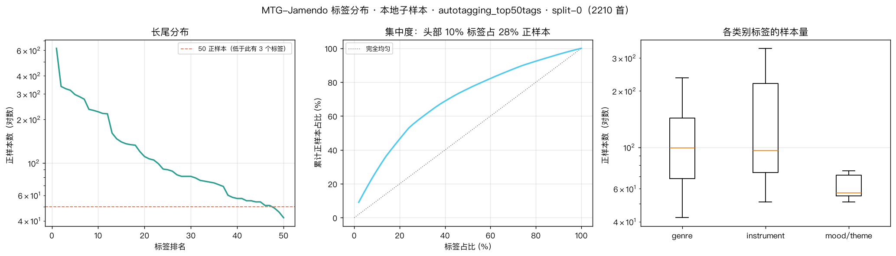

# MTG-Jamendo 标签分布

- 范围：本地子样本 · autotagging_top50tags · split-0（2210 首）
- 命令：`python -m scripts.jamendo_stats --subset autotagging_top50tags --min-positives 0`

## 总览

| 项 | 值 |
|---|---|
| 曲目数 | 2,210 |
| 总时长 | 145 小时 |
| 标签数 | 50 |
| 每首平均标签数 | 3.07 |
| 标签矩阵密度 | 6.14%（**其余 93.9% 是 0**）|
| 最高频标签正样本 | 619 |
| 中位标签正样本 | 89 |
| 最低频标签正样本 | 42 |
| 头部 10% 标签占正样本比例 | **28%** |
| 正样本 < 50 的标签数 | **3 / 50** |

## 各类别

| 类别 | 标签数 | 最少 | 中位 | 最多 |
|---|---|---|---|---|
| genre | 31 | 42 | 99 | 619 |
| instrument | 14 | 51 | 96 | 338 |
| mood/theme | 5 | 51 | 57 | 75 |

## 各 split

| split | 曲目数 | 时长(h) |
|---|---|---|
| train | 1,290 | 86 |
| validation | 466 | 29 |
| test | 454 | 31 |

## 逐标签阈值调优的可行性（L4）

验证集共 466 首。**正样本 < 10 的标签有 10 / 50 个** —— 在这些标签上搜阈值等于过拟合噪声。

最稀薄的 10 个：`genre---world`(3)、`genre---popfolk`(4)、`mood/theme---film`(4)、`mood/theme---energetic`(6)、`genre---reggae`(7)、`genre---house`(8)、`genre---techno`(8)、`mood/theme---relaxing`(8)、`genre---poprock`(9)、`instrument---acousticguitar`(9)

## 最高频 15 个标签

| 标签 | 正样本 | 占比 |
|---|---|---|
| `genre---electronic` | 619 | 28.0% |
| `instrument---piano` | 338 | 15.3% |
| `genre---soundtrack` | 326 | 14.8% |
| `genre---pop` | 318 | 14.4% |
| `genre---ambient` | 297 | 13.4% |
| `instrument---synthesizer` | 287 | 13.0% |
| `genre---rock` | 276 | 12.5% |
| `genre---classical` | 235 | 10.6% |
| `instrument---drums` | 231 | 10.5% |
| `genre---easylistening` | 226 | 10.2% |
| `instrument---guitar` | 220 | 10.0% |
| `instrument---bass` | 219 | 9.9% |
| `instrument---electricguitar` | 161 | 7.3% |
| `genre---chillout` | 147 | 6.7% |
| `genre---experimental` | 140 | 6.3% |

## 最低频 15 个标签

| 标签 | 正样本 |
|---|---|
| `mood/theme---film` | 71 |
| `instrument---strings` | 69 |
| `genre---instrumentalpop` | 60 |
| `genre---atmospheric` | 58 |
| `genre---trance` | 57 |
| `mood/theme---emotional` | 57 |
| `genre---triphop` | 55 |
| `mood/theme---relaxing` | 55 |
| `genre---funk` | 54 |
| `instrument---drummachine` | 54 |
| `mood/theme---energetic` | 51 |
| `instrument---electricpiano` | 51 |
| `genre---metal` | 49 |
| `genre---downtempo` | 46 |
| `genre---reggae` | 42 |

